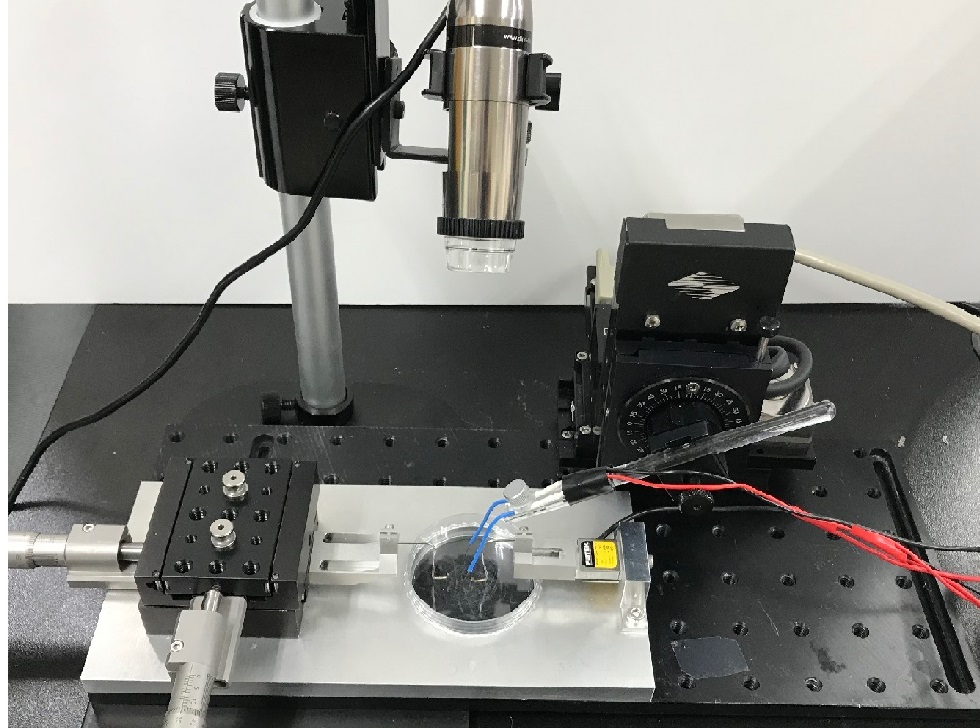
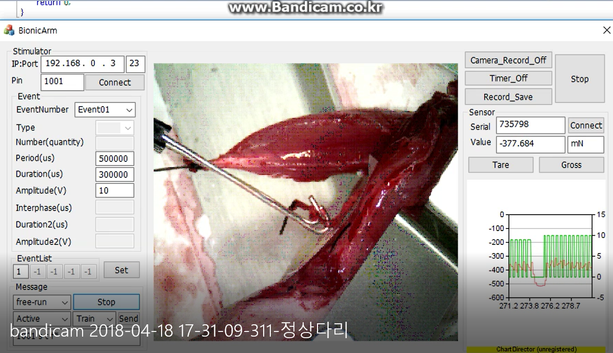

# MESS
Electrical Stimulation Platform for Muscular &amp; Nervous Tissue

## Architecture
[Hardawre]
- Electrical stimulator: AMS4100M
- Force sensor: Futek
- Signal Logger(DAQ): National Instruments

[Software]
- Interface: MFC
- Optic: openCV
- Chart plot: ChartDirector

## Platform
- Overall     
     
   
## Experiment
- Flat fish (201802)    
     
- Artifical cell (201806)      
     
- Mouse leg (201807)      

## Related works
- Yeong-Jin Choi et al., A 3D cell printed muscle construct with tissue-derived bioink for the treatment of volumetric muscle loss, Biomaterials 2019

## Contributors
이주용 강준수
